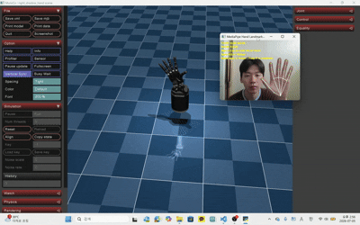
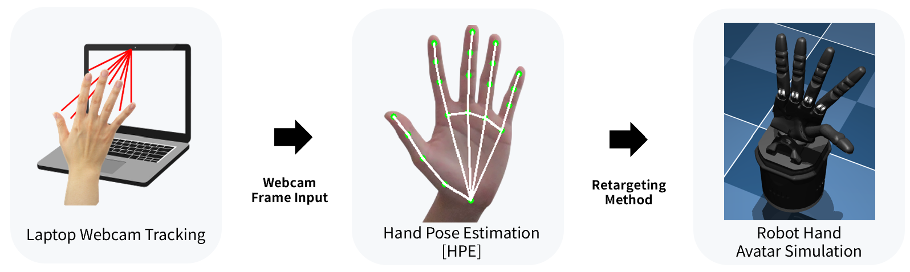
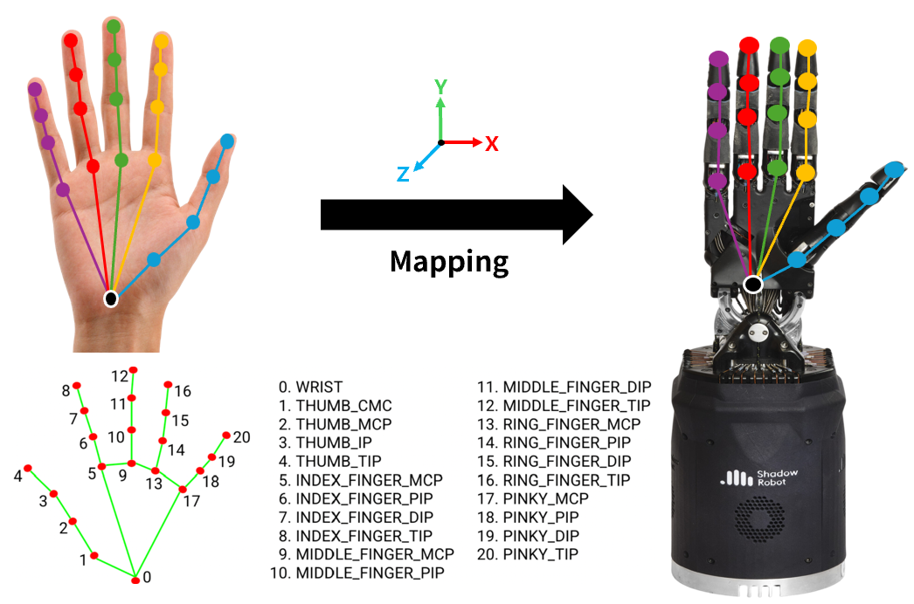
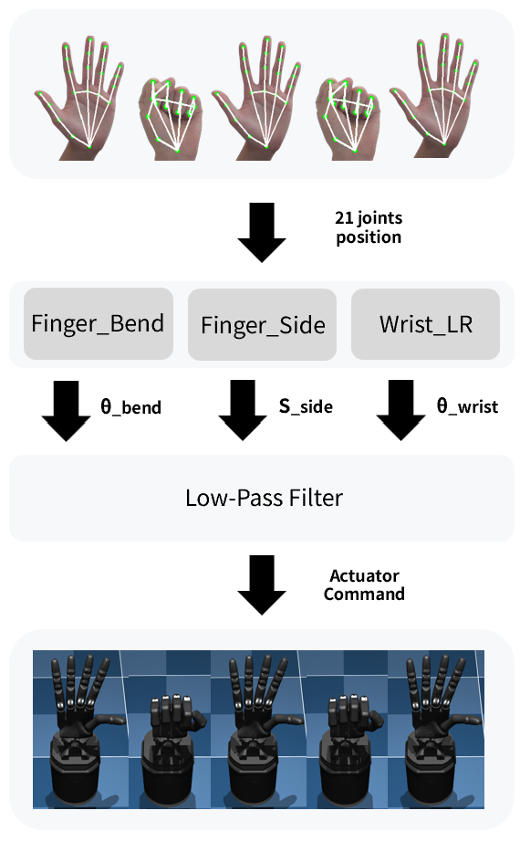
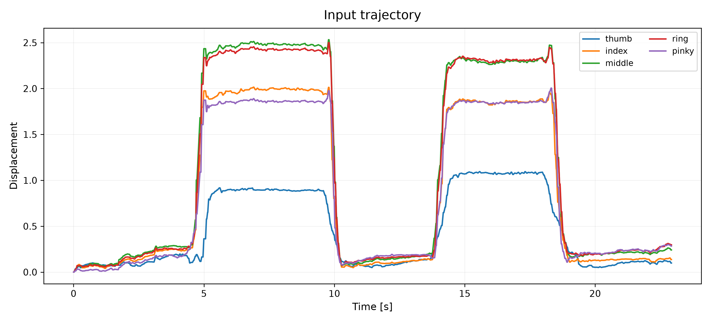
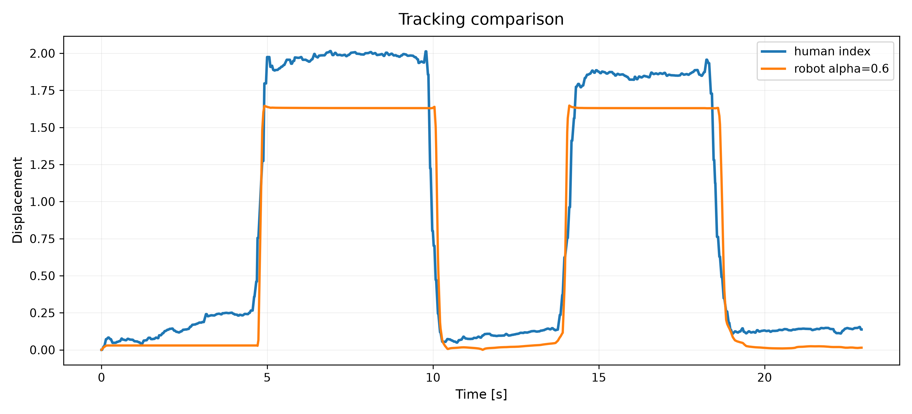
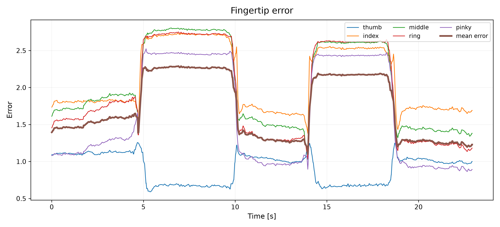
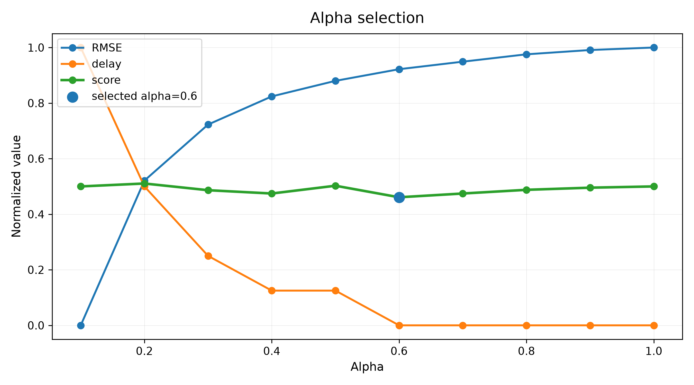

# Vision-Based Robotic Hand Avatar Simulation

## Project Overview

This project implements a webcam-based Shadow Hand avatar simulation using MediaPipe and MuJoCo. Human hand motion is captured from a laptop webcam, converted into finger bending, side-spreading, and wrist lateral motion values, and then mapped to the actuator inputs of the MuJoCo Shadow Hand model.

The objective of this project is to retarget human hand motion to a robot hand with different degrees of freedom and evaluate its tracking performance using fingertip-based metrics.

---

## System Overview

The overall system consists of webcam-based hand motion capture, hand pose estimation, motion value calculation, and Shadow Hand avatar simulation.

<p align="center">
  
  
</p>

---

## System Pipeline

```text
Webcam Frame Input
      ↓
MediaPipe Hand Pose Estimation
      ↓
21 Hand Landmark Positions
      ↓
Finger Bend / Finger Side / Wrist LR Calculation
      ↓
Low-Pass Filter
      ↓
Actuator Command Mapping
      ↓
MuJoCo Shadow Hand Avatar Simulation
      ↓
Fingertip Tracking Evaluation
```

The detailed motion-value generation pipeline and landmark-to-robot mapping concept are shown below.

<p align="center">
  
  &nbsp;&nbsp;&nbsp;
  
</p>

In this pipeline, the MediaPipe hand landmarks are converted into three motion values: finger bending angle, finger side-spreading value, and wrist lateral angle. These values are represented as $\theta_{bend}$, $s_{side}$, and $\theta_{wrist}$.

---

## Tech Stack

| Category | Tool |
|---|---|
| Development Environment | VS Code |
| Language | Python |
| Webcam Processing | OpenCV |
| Hand Pose Estimation | MediaPipe Hand Landmarker |
| Robot Hand Model | Shadow Hand robot E3M5 |
| Simulation Environment | MuJoCo |
| Data Analysis | NumPy, Pandas, Matplotlib |

---

## Key Implementation

### Variable Definition

| Symbol | Description |
|---|---|
| $P_i$ | i-th MediaPipe hand landmark |
| $P_i=(x_i,y_i,z_i)$ | 3D coordinate of the i-th landmark |
| $\mathbf{u}, \mathbf{v}$ | Adjacent finger bone vectors |
| $\theta_{bend}$ | Finger bending angle calculated from adjacent landmarks |
| $b_f$ | Normalized finger bending value |
| $s_{side}$ | Normalized finger side-spreading value |
| $W_p$ | Palm width for normalization |
| $\mathbf{v}_{palm}$ | Palm direction vector |
| $\theta_{wrist}$ | Wrist lateral angle |
| $\alpha$ | Smoothing parameter |
| $u_t^{raw}$ | Raw motion value |
| $u_t$ | Filtered motion value |
| $c_i$ | Actuator command |
| $e_f$ | Fingertip tracking error |
| $RMSE$ | Root mean square tracking error |
| $Delay$ | Response delay |
| $Score$ | Final smoothing-parameter selection score |

---

## Hand Landmark Extraction

Webcam frames were captured using OpenCV and processed with MediaPipe Hand Landmarker. MediaPipe extracts 21 hand landmark positions, including the wrist and finger joints.

Each landmark is represented as a 3D coordinate.

```math
P_i = (x_i, y_i, z_i), \quad i = 0,1,\dots,20
```

Here, $P_0$ is the wrist landmark, and the remaining landmarks represent the joints of the thumb, index, middle, ring, and pinky fingers.

The extracted landmark coordinates were used to calculate finger bending, finger side-spreading, and wrist lateral motion values.

---

## Motion Value Calculation

### 1. Finger Bending Angle

Finger bending was calculated using the angle between two adjacent finger bone vectors.

```math
\mathbf{u} = P_a - P_b
```

```math
\mathbf{v} = P_c - P_b
```

```math
\theta_{bend} =
\cos^{-1}
\left(
\frac{
\mathbf{u} \cdot \mathbf{v}
}{
\|\mathbf{u}\| \, \|\mathbf{v}\|
}
\right)
```

The calculated bending angle was normalized into a bending value.

```math
b_f = \mathrm{normalize}(\theta_{bend})
```

A value close to 0 indicates an extended finger, while a value close to 1 indicates a bent finger.

---

### 2. Finger Side-spreading Value

Finger side-spreading was calculated using the lateral displacement between the MCP and PIP landmarks.

The palm width was defined as:

```math
W_p = |x_5 - x_{17}|
```

The side-spreading value was calculated as:

```math
s_{side} =
\frac{
x_{PIP} - x_{MCP}
}{
W_p
}
```

Here, $s_{side}$ is not a direct joint angle. It is a normalized lateral spreading value calculated from the landmark coordinates.

---

### 3. Wrist Lateral Angle

Wrist left-right motion was estimated from the palm direction vector between the wrist landmark and the middle finger MCP landmark.

```math
\mathbf{v}_{palm} = P_9 - P_0
```

The wrist lateral angle was calculated from this palm direction vector.

```math
\theta_{wrist} =
\mathrm{atan2}
\left(
x_9 - x_0,
-(y_9 - y_0)
\right)
```

The calculated wrist angle was then normalized and mapped to the wrist actuator command.

---

## Low-Pass Filter

MediaPipe landmark data can contain small frame-to-frame noise. To reduce jitter, a first-order low-pass filter was applied to the calculated motion values.

```math
u_t =
(1-\alpha)u_{t-1}
+
\alpha u_t^{raw}
```

where $u_t^{raw}$ is the raw motion value from the current frame, $u_t$ is the filtered motion value, and $\alpha$ is the smoothing parameter.

In this project, $u$ can represent the finger bending value, side-spreading value, or wrist lateral angle.

```math
u \in \{ b_f,\; s_{side},\; \theta_{wrist} \}
```

A smaller smoothing parameter produces smoother motion but increases response delay. A larger smoothing parameter improves responsiveness but becomes more sensitive to landmark noise.

---

## Actuator Command Mapping

The proposed method does not directly control fingertip positions. Instead, the calculated motion values are mapped to Shadow Hand actuator commands.

The filtered motion value was mapped to the actuator control range of the MuJoCo Shadow Hand model.

```math
c_i =
c_{min,i}
+
r_i \left( c_{max,i} - c_{min,i} \right)
```

where $c_i$ is the actuator command, $c_{min,i}$ and $c_{max,i}$ are the minimum and maximum actuator control values, and $r_i$ is the normalized input ratio.

The final actuator command was applied to MuJoCo through `data.ctrl`.

```math
\texttt{data.ctrl}[i] = c_i
```

Through this mapping, human hand motion calculated from MediaPipe landmarks was converted into Shadow Hand actuator commands for real-time avatar simulation.

---

## Simulation Result & Analysis

The same recorded raw hand landmark data was replayed with different smoothing parameter values to compare tracking error and response delay under identical input conditions.

### 1. Input Trajectory

<p align="center">
  
</p>

The input trajectory was used to verify whether the human hand motion was correctly captured from the webcam.

In this graph, the fingertip displacement value represents how much each human fingertip moved from its initial position. A larger displacement means that the corresponding finger moved more actively during the motion.

The repeated increase and decrease of the displacement indicates that the grasping and opening motion was successfully recorded. Therefore, this graph confirms that the raw MediaPipe landmark data contains a usable hand motion pattern for replay-based simulation.

---

### 2. Tracking Comparison

<p align="center">
  
</p>

The tracking comparison graph shows the displacement of the human fingertip and the MuJoCo Shadow Hand fingertip over time.

In this graph, the similarity between the human trajectory and the robot trajectory indicates how well the robot hand follows the input hand motion. If the two curves increase and decrease at similar timing, it means that the actuator mapping successfully reproduces the overall motion trend.

The difference between the two curves represents tracking mismatch caused by the structural difference between the human hand and the Shadow Hand. Therefore, this graph was used to check whether the robot hand follows the general motion pattern rather than perfectly matching the exact fingertip position.

---

### 3. Fingertip Error

<p align="center">
  
</p>

Fingertip error was calculated to quantitatively evaluate the tracking performance of the robot hand.

The fingertip error for finger $f$ was defined as:

```math
e_f(t) =
\left\|
\Delta P_f^{human}(t)
-
\Delta P_f^{robot}(t)
\right\|
```

where:

```math
\Delta P_f(t) = P_f(t) - P_f(0)
```

In this graph, a lower error value means that the robot fingertip movement is closer to the human fingertip movement. A higher error value means that the robot hand failed to follow the human motion accurately at that moment.

The error tends to increase during fast transition motions, such as grasping or opening, because the robot actuator response and the filtered landmark input cannot change instantly. On the other hand, the error decreases when the hand posture becomes stable.

This graph was used to identify which fingers showed larger tracking mismatch and when the tracking error mainly occurred.

---

### 4. Smoothing Parameter Selection

<p align="center">
  
</p>

The smoothing parameter was selected by comparing tracking error and response delay.

The tracking error was evaluated using RMSE.

```math
RMSE =
\sqrt{
\frac{1}{N}
\sum_{t=1}^{N}
e_{overall}(t)^2
}
```

RMSE represents the overall tracking error during the entire motion. A lower RMSE means that the robot hand followed the human hand motion more accurately.

Response delay represents how late the robot hand responds to the human hand motion. A smaller delay means that the robot hand reacts more quickly.

Because RMSE and delay have different units, min-max normalization was applied.

```math
\hat{x} =
\frac{x - x_{min}}
{x_{max} - x_{min}}
```

The final score was calculated as:

```math
Score =
0.5 \hat{RMSE}
+
0.5 \hat{Delay}
```

In this graph, the smoothing parameter with the lowest score was selected as the best value because it provides the best balance between tracking accuracy and response speed.

A smaller smoothing parameter reduces jitter but increases delay, while a larger smoothing parameter improves response speed but becomes more sensitive to landmark noise.

---

## Result Summary

This project implemented a webcam-based Shadow Hand avatar simulation using MediaPipe and MuJoCo.

Human hand landmarks were extracted from webcam input, and the landmark coordinates were converted into finger bending, side-spreading, and wrist lateral motion values. These values were filtered using a low-pass filter and mapped to the actuator inputs of the MuJoCo Shadow Hand model.

The tracking performance was evaluated using fingertip error, RMSE, response delay, and smoothing-parameter score. The final smoothing parameter was selected by considering both tracking accuracy and response delay.

---

## Limitations and Future Work

The human hand and the Shadow Hand have different joint structures and degrees of freedom, making exact fingertip correspondence difficult. Thumb motion is particularly challenging to reproduce because of its opposition and complex rotational movement. In addition, vision-only motion capture based on MediaPipe is affected by occlusion, viewpoint changes, and landmark estimation noise, which can reduce the stability and accuracy of robot hand motion.

The current implementation employs an angle-based actuator mapping method rather than directly solving inverse kinematics for fingertip positions. While this approach enables stable real-time avatar control, it does not guarantee accurate fingertip position correspondence.

Future work will focus on improving motion retargeting accuracy through inverse kinematics, robot–human hand correspondence, and learning-based mapping methods. To overcome the limitations of vision-only motion capture, wearable human interfaces may also be integrated to measure hand motion more reliably and support more accurate and intuitive avatar teleoperation.
