# Webcam-based Shadow Hand Avatar Simulation

## Project Overview

This project implements a webcam-based Shadow Hand avatar simulation using MediaPipe and MuJoCo. Human hand motion is captured from a laptop webcam, converted into finger bending, side-spreading, and wrist lateral motion values, and then mapped to the actuator inputs of the MuJoCo Shadow Hand model.

The objective of this project is to retarget human hand motion to a robot hand with different degrees of freedom and evaluate its tracking performance using fingertip-based metrics.

---

## System Overview

The overall system consists of webcam-based hand motion capture, hand pose estimation, motion value calculation, and Shadow Hand avatar simulation.

<p align="center">
  
</p>

---

## System Pipeline

```text
Webcam Frame Input
      ↓
MediaPipe Hand Pose Estimation
      ↓
21 Hand Landmark Positions
      ↓
Finger Bend / Finger Side / Wrist LR Calculation
      ↓
Low-Pass Filter
      ↓
Actuator Command Mapping
      ↓
MuJoCo Shadow Hand Avatar Simulation
      ↓
Fingertip Tracking Evaluation
```

The detailed motion-value generation pipeline and landmark-to-robot mapping concept are shown below.

<p align="center">
  
  &nbsp;&nbsp;&nbsp;
  
</p>

---

## Experiment Workflow

The experiment was conducted by first recording raw hand landmark data from the webcam.  
After recording, the same raw data was replayed with different smoothing parameter values to compare tracking error and response delay under identical input conditions.

```mermaid
flowchart LR
    A[Webcam-based Hand Motion Recording] --> B[Raw Landmark Data Logging]
    B --> C[Raw Input Trajectory Extraction]
    C --> D[Replay with Different Smoothing Parameters]
    D --> E[MuJoCo Shadow Hand Simulation]
    E --> F[Fingertip Tracking Error Calculation]
    F --> G[RMSE and Delay Comparison]
    G --> H[Smoothing Parameter Selection]
    H --> I[Result Graph Generation]
```



This workflow allows each smoothing parameter to be evaluated using the same input motion data.  
Therefore, the comparison between smoothing parameters is based on identical hand motion rather than different real-time trials.

---

## Tech Stack

| Category | Tool |
|---|---|
| Development Environment | VS Code |
| Language | Python |
| Webcam Processing | OpenCV |
| Hand Pose Estimation | MediaPipe Hand Landmarker |
| Robot Hand Model | Shadow Hand robot E3M5 |
| Simulation Environment | MuJoCo |
| Data Analysis | NumPy, Pandas, Matplotlib |

---

## Key Implementation

### Variable Definition

| Symbol | Description |
|---|---|
| $P_i$ | i-th MediaPipe hand landmark |
| $P_i=(x_i,y_i,z_i)$ | 3D coordinate of the i-th landmark |
| $\mathbf{u}, \mathbf{v}$ | Adjacent finger bone vectors |
| $\theta$ | Joint angle between two vectors |
| $b_f$ | Finger bending value |
| $s_f$ | Finger side-spreading value |
| $W_p$ | Palm width for normalization |
| $\mathbf{v}_{palm}$ | Palm direction vector |
| $w_{lr}$ | Wrist left-right motion value |
| $\alpha$ | Smoothing parameter |
| $u_t^{raw}$ | Raw motion value |
| $u_t$ | Filtered motion value |
| $c_i$ | Actuator command |
| $e_f$ | Fingertip tracking error |
| $RMSE$ | Root mean square tracking error |
| $Delay$ | Response delay |
| $Score$ | Final smoothing-parameter selection score |

---

## Hand Landmark Extraction

Webcam frames were captured using OpenCV and processed with MediaPipe Hand Landmarker. MediaPipe extracts 21 hand landmark positions, including the wrist and finger joints.

Each landmark is represented as a 3D coordinate.

```math
P_i = (x_i, y_i, z_i), \quad i = 0,1,\dots,20
```

Here, $P_0$ is the wrist landmark, and the remaining landmarks represent the joints of the thumb, index, middle, ring, and pinky fingers.

The extracted landmark coordinates were used to calculate finger bending, finger side-spreading, and wrist lateral motion values.

---

## Motion Value Calculation

### 1. Finger Bending Value

Finger bending was calculated using the angle between two adjacent finger bone vectors.

```math
\mathbf{u} = P_a - P_b
```

```math
\mathbf{v} = P_c - P_b
```

```math
\theta =
\cos^{-1}
\left(
\frac{
\mathbf{u} \cdot \mathbf{v}
}{
\|\mathbf{u}\| \, \|\mathbf{v}\|
}
\right)
```

The calculated angle was normalized into a bending value.

```math
b_f = \mathrm{normalize}(\theta)
```

A value close to 0 indicates an extended finger, while a value close to 1 indicates a bent finger.

---

### 2. Finger Side-spreading Value

Finger side-spreading was calculated using the lateral displacement between the MCP and PIP landmarks.

The palm width was defined as:

```math
W_p = |x_5 - x_{17}|
```

The side-spreading value was calculated as:

```math
s_f =
\frac{
x_{PIP} - x_{MCP}
}{
W_p
}
```

Here, $s_f$ is not a direct joint angle. It is a normalized lateral spreading value calculated from the landmark coordinates.

---

### 3. Wrist Left-right Motion Value

Wrist left-right motion was estimated from the palm direction vector between the wrist landmark and the middle finger MCP landmark.

```math
\mathbf{v}_{palm} = P_9 - P_0
```

The wrist left-right value was calculated from the angle of this palm direction vector and normalized for actuator control.

---

## Low-Pass Filter

MediaPipe landmark data can contain small frame-to-frame noise. To reduce jitter, a first-order low-pass filter was applied to the calculated motion values.

```math
u_t =
(1-\alpha)u_{t-1}
+
\alpha u_t^{raw}
```

where $u_t^{raw}$ is the raw motion value from the current frame, $u_t$ is the filtered motion value, and $\alpha$ is the smoothing parameter.

In this project, $u$ can represent the finger bending value, side-spreading value, or wrist left-right value.

```math
u \in \{ b_f,\; s_f,\; w_{lr} \}
```

A smaller smoothing parameter produces smoother motion but increases response delay. A larger smoothing parameter improves responsiveness but becomes more sensitive to landmark noise.

---

## Actuator Command Mapping

The proposed method does not directly control fingertip positions. Instead, the calculated motion values are mapped to Shadow Hand actuator commands.

The filtered motion value was mapped to the actuator control range of the MuJoCo Shadow Hand model.

```math
c_i =
c_{min,i}
+
r_i \left( c_{max,i} - c_{min,i} \right)
```

where $c_i$ is the actuator command, $c_{min,i}$ and $c_{max,i}$ are the minimum and maximum actuator control values, and $r_i$ is the normalized input ratio.

The final actuator command was applied to MuJoCo through `data.ctrl`.

```math
\texttt{data.ctrl}[i] = c_i
```

Through this mapping, human hand motion calculated from MediaPipe landmarks was converted into Shadow Hand actuator commands for real-time avatar simulation.

---

## Simulation Result & Analysis

### 1. Input Trajectory

<p align="center">
  
</p>

The input trajectory was used to verify whether the human hand motion was correctly captured from the webcam.

Fingertip displacement was calculated from the initial position of each finger. During repeated grasping and opening motion, the displacement increased and decreased periodically.

This confirms that the MediaPipe landmark data properly captured the input hand motion.

---

### 2. Tracking Comparison

<p align="center">
  
</p>

The tracking comparison graph compares the fingertip displacement of the human hand and the MuJoCo Shadow Hand.

The robot hand displacement changed according to the grasping and opening motion of the human hand. This shows that the landmark-based motion values were successfully converted into Shadow Hand avatar motion.

Since the human hand and Shadow Hand have different joint structures and link lengths, the trajectories are not completely identical. Therefore, the main evaluation focus was the overall tracking trend rather than exact position matching.

---

### 3. Fingertip Error

<p align="center">
  
</p>

Fingertip error was calculated to quantitatively evaluate the tracking performance of the robot hand.

The fingertip error for finger $f$ was defined as:

```math
e_f(t) =
\left\|
\Delta P_f^{human}(t)
-
\Delta P_f^{robot}(t)
\right\|
```

where:

```math
\Delta P_f(t) = P_f(t) - P_f(0)
```

The error increased during fast transition motions such as grasping and opening, and decreased when the hand posture became stable.

The thumb showed a different error pattern because its opposition and rotation motion is more complex than the other fingers.

---

### 4. Smoothing Parameter Selection

<p align="center">
  
</p>

The smoothing parameter was selected by comparing tracking error and response delay.

The tracking error was evaluated using RMSE.

```math
RMSE =
\sqrt{
\frac{1}{N}
\sum_{t=1}^{N}
e_{overall}(t)^2
}
```

Because RMSE and delay have different units, min-max normalization was applied.

```math
\hat{x} =
\frac{x - x_{min}}
{x_{max} - x_{min}}
```

The final score was calculated as:

```math
Score =
0.5 \hat{RMSE}
+
0.5 \hat{Delay}
```

The smoothing parameter with the lowest score was selected.

---

## Result Summary

This project implemented a webcam-based Shadow Hand avatar simulation using MediaPipe and MuJoCo.

Human hand landmarks were extracted from webcam input, and the landmark coordinates were converted into finger bending, side-spreading, and wrist lateral motion values. These values were filtered using a low-pass filter and mapped to the actuator inputs of the MuJoCo Shadow Hand model.

The tracking performance was evaluated using fingertip error, RMSE, response delay, and smoothing-parameter score. The final smoothing parameter was selected by considering both tracking accuracy and response delay.

---

## Limitations and Future Work

The human hand and Shadow Hand have different joint structures and degrees of freedom, which makes exact fingertip matching difficult.

Thumb motion is especially difficult to reproduce because it includes opposition and complex rotation. MediaPipe landmark noise can also affect the stability of the robot hand motion.

The current implementation uses an angle-based actuator mapping method instead of directly solving inverse kinematics for fingertip positions. This approach provides stable real-time avatar control, but it does not guarantee exact fingertip position matching.

Future work will focus on improving motion retargeting accuracy using inverse kinematics, robot landmark correspondence, or learning-based mapping methods.
